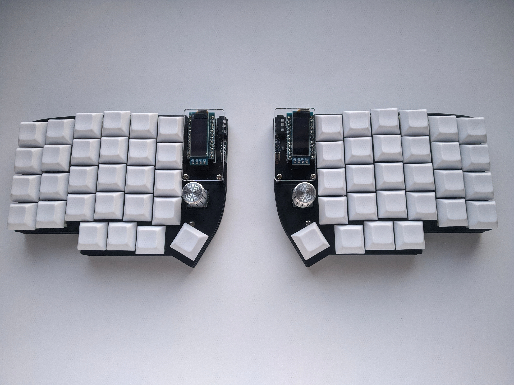

# Lily58 Pro RE
This fork adds a rotary encoder to the [Pro](https://github.com/kata0510/Lily58/tree/master/Pro) version of [Lily58](https://github.com/kata0510/Lily58) and is compatible with the original board.  

## TODOs

- [ ] update build guide
- [ ] firmware guide
Hi dear, can u please provide me Gerber files with format RS274X of your Lily58pro-re PCB, if possible  ?
